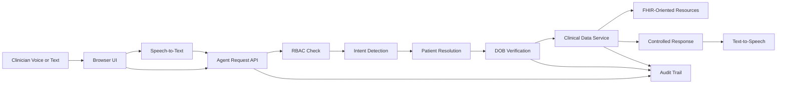

# MediVoice AI

### Intelligent Patient Record Retrieval Through Voice AI

**MediVoice AI** is a healthcare AI prototype that allows an authorized clinical user to retrieve structured patient information through natural-language voice or text commands. The current **Phase 0.2 MVP** demonstrates patient matching, DOB verification, deterministic clinical-data retrieval, FHIR-oriented resources, spoken responses, RBAC scaffolding, and audit logging using **synthetic patient data only**.

> **Status:** Active Development — Phase 0.2 MVP  
> **Safety:** Synthetic demonstration data only. Not for clinical use. No real PHI is included.

## Why this project

Clinical staff often spend valuable time navigating multiple screens to locate routine patient information. MediVoice AI explores a safer voice-first retrieval pattern where conversational AI interprets the user's request, while patient facts remain sourced from deterministic clinical services rather than being invented by a language model.

## Current capabilities

- Browser-based speech-to-text for voice requests
- Text-to-speech for spoken MediVoice responses
- Conversational intent detection for labs, allergies, medications, diagnoses, appointments, and summaries
- Patient matching by full name or medical record number (MRN)
- DOB verification challenge before clinical record release
- Demo role-based access control for `clinician`, `nurse`, and `records`
- Structured audit events for challenge, allow, deny, and no-match outcomes
- FHIR-oriented `Patient/$everything` bundle
- Clinician-friendly patient summary interface
- FastAPI REST API with Swagger/OpenAPI documentation
- Docker Compose development environment
- Automated API validation with Pytest

## Example interaction

**Clinician:** “Retrieve Juan Dela Cruz latest laboratory results.”

**MediVoice:** “I found Juan Dela Cruz. Please confirm the patient's date of birth.”

**Clinician:** “November 4 1978.”

**MediVoice:** Retrieves the authorized synthetic laboratory record, displays the verified patient information, speaks the result, and writes an audit event.

## Architecture



### Design principle

The conversational layer is **not the clinical source of truth**. It interprets what the user is asking for, but patient facts are returned from deterministic structured records/FHIR-oriented services under verification and authorization controls.

## Supported clinical intents

| Intent | Clinical resource |
|---|---|
| `GET_LATEST_LABS` | `Observation` |
| `GET_ALLERGIES` | `AllergyIntolerance` |
| `GET_MEDICATIONS` | `MedicationRequest` |
| `GET_DIAGNOSES` | `Condition` |
| `GET_APPOINTMENT` | `Appointment` |
| `GET_SUMMARY` | Patient summary |

## Technology stack

**Backend:** Python, FastAPI, Pydantic, REST/OpenAPI  
**Healthcare interoperability:** FHIR-oriented resource modeling  
**Frontend:** HTML, CSS, JavaScript  
**Voice:** Web Speech API, SpeechSynthesis  
**Testing:** Pytest, HTTPX  
**Runtime:** Docker, Docker Compose, Nginx, Uvicorn

## Project structure

```text
medivoice-ai/
├── backend/
│   ├── app/
│   │   └── main.py
│   ├── tests/
│   │   └── test_api.py
│   ├── Dockerfile
│   └── requirements.txt
├── frontend/
│   ├── Dockerfile
│   └── index.html
├── docs/
│   ├── PHASE_0_1.md
│   ├── PHASE_0_2.md
│   └── PORTFOLIO.md
├── docker-compose.yml
└── README.md
```

## Run locally

Prerequisite: Docker Desktop with the Linux/WSL2 engine running.

```powershell
cd C:\ammdev\medivoice-ai
docker compose down
docker compose up --build
```

Open:

- **MediVoice UI:** `http://localhost:8080`
- **Swagger API:** `http://localhost:8000/docs`
- **Health check:** `http://localhost:8000/health`

## Voice demo

1. Open the UI in Chrome or Edge.
2. Click **Voice** and allow microphone access.
3. Say: **“Retrieve Juan Dela Cruz latest laboratory results.”**
4. When prompted, click **Voice** again and say: **“November 4 1978.”**
5. MediVoice displays and speaks the synthetic results and records the access event.

A second synthetic patient, **Maria Santos**, can be tested with DOB **March 12 1985**.

## API endpoints

```text
GET  /health
GET  /patients/search?q=Maria
GET  /patients/{patient_id}
GET  /patients/{patient_id}/summary
GET  /fhir/Patient/{patient_id}/$everything
POST /agent/query
POST /agent/verify
GET  /audit
```

## Automated tests

```powershell
cd backend
python -m pytest -q
```

Phase 0.2 has automated coverage for health checks, patient retrieval, intent flows, verification outcomes, FHIR-oriented retrieval, authorization behavior, and audit events.

## Security and clinical limitations

This repository is an engineering prototype and must **not** be used with real patient information in its current form. The included RBAC, DOB verification, in-memory challenges, FHIR representations, and audit events demonstrate architectural control flow; they are not production identity proofing, consent management, HIPAA compliance, medical-device validation, or a certified FHIR implementation.

Before any real-world clinical integration, the platform would require production-grade authentication and authorization, encrypted persistent storage, secrets management, consent/minimum-necessary controls, immutable audit retention, security testing, privacy review, clinical governance, and applicable regulatory/compliance assessment.

## Roadmap

### Phase 0.3 — Persistent Clinical Platform

- PostgreSQL persistence
- OAuth2 / OpenID Connect authentication
- Stronger role and permission policy enforcement
- Expiring verification sessions
- Normalized and validated FHIR repository
- Pluggable LLM orchestration with structured tool calls
- Response provenance and stronger guardrails
- STT/TTS provider abstraction
- Realtime/WebSocket voice-session foundation

### Future direction

- EHR/EMR integration through standards-based APIs
- Encounter and clinical-note retrieval
- Provider-aware permissions
- Consent and break-glass workflows
- Cloud deployment and observability
- Secure clinical summarization with source provenance

## Portfolio positioning

MediVoice AI demonstrates work across **Voice AI, healthcare interoperability, API design, agentic workflow architecture, security controls, Dockerized services, frontend UX, and automated testing**.

---

**MediVoice AI — Active Development / Synthetic Data / Not for Clinical Use**
